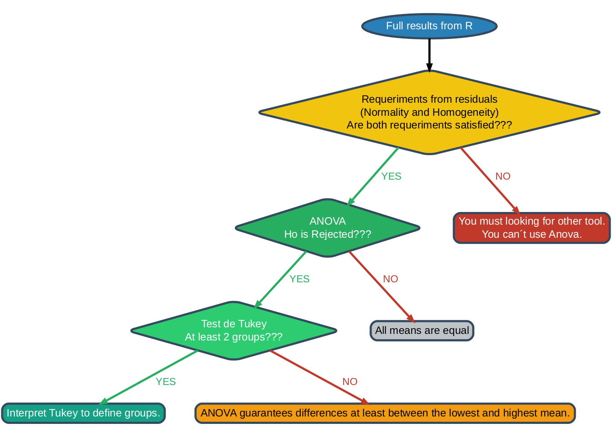

## Diagrama de Flujo para Análisis ANOVA

```{r}
#| echo: false
#| warning: false
#| message: false
# Load required libraries
library("DiagrammeR")
library("rsvg")
library("magrittr")
library("DiagrammeRsvg")

# CONFIGURABLE PARAMETERS
config <- list(
  # Colors and backgrounds
  background_color = "#ffffff",      # Background color of the image
  default_fontsize = 20,            # Base font size
  default_penwidth = 4,             # Base line thickness
  node_width = 2.0,                 # Node width
  image_width = 1400,               # PNG image width
  image_height = 1000               # PNG image height
)

# Create and save diagram as PNG
dot_code <- paste0('
digraph ANOVA_DecisionTree {
    
    graph [
        layout = dot,
        rankdir = TB,               // Vertical layout (Top to Bottom)
        splines = true,             // Curved lines
        bgcolor = "', config$background_color, '",  // CONFIGURABLE BACKGROUND COLOR
        fontname = "Arial",
        fontsize = ', config$default_fontsize, ',   // GENERAL FONT SIZE
        ranksep = 0.8,              // Vertical spacing between levels
        nodesep = 0.4               // Horizontal spacing between nodes
    ] 
    
    node [
        fontname = "Arial",
        fontsize = ', config$default_fontsize, ',   // APPLIES TO ALL NODES
        style = "filled, rounded",
        color = "#34495e",           // Node border color
        penwidth = ', config$default_penwidth, ',   // NODE BORDER THICKNESS
        width = ', config$node_width, '             // NODE WIDTH
    ]
    
    edge [
        fontname = "Arial",
        fontsize = ', (config$default_fontsize - 1), ',  // Slightly smaller than nodes
        penwidth = ', config$default_penwidth, '         // LINE THICKNESS
    ]

    // Main nodes
    A [label = "Full results from R", 
       shape = oval, fillcolor = "#2980b9", fontcolor = "white"]
    
    B [label = "Requeriments from residuals\\n(Normality and Homogeneity)\\nAre both requeriments satisfied???", 
       shape = diamond, fillcolor = "#f1c40f", fontcolor = "black"]
                
    C [label = "You must looking for other tool.\\nYou can´t use Anova.", 
      shape = box, fillcolor = "#c0392b", fontcolor = "white"]
    
    D [label = "ANOVA\\nHo is Rejected???", 
       shape = diamond, fillcolor = "#27ae60", fontcolor = "white"]
    
    E [label = "Test de Tukey\\nAt least 2 groups???", 
       shape = diamond, fillcolor = "#2ecc71", fontcolor = "white"]
       
    F1 [label = "All means are equal", shape = box, fillcolor = "#bdc3c7", fontcolor = "black"]
                
    F2 [label = "Interpret Tukey to define groups.", 
        shape = box, fillcolor = "#16a085", fontcolor = "white"]
        
    F3 [label = "ANOVA guarantees differences at least between the lowest and highest mean.",
        shape = box, fillcolor = "#f39c12", fontcolor = "black"]

    // CONNECTIONS - "YES" on top, "NO" on bottom
    // Results -> Requirements check
    A -> B
    
    // From Requirements check
    B -> D [label = "  YES  ", color = "#27ae60", fontcolor = "#27ae60"]
    B -> C [label = "  NO  ", color = "#c0392b", fontcolor = "#c0392b"]
    
    // From ANOVA
    D -> E [label = "  YES  ", color = "#27ae60", fontcolor = "#27ae60"]
    D -> F1 [label = "  NO  ", color = "#c0392b", fontcolor = "#c0392b"]
    
    // From Tukey Test
    E -> F2 [label = "  YES  ", color = "#27ae60", fontcolor = "#27ae60"]
    E -> F3 [label = "  NO  ", color = "#c0392b", fontcolor = "#c0392b"]

    // ALIGNMENT to place "YES" above "NO" in each decision
    
    // Rows: top nodes
    {rank = same; A}
    {rank = same; B}
    
    // Main decision rows - YES above, NO below
    {rank = same; D; C}   // D (YES) above, C (NO) below
    {rank = same; E; F1}  // E (YES) above, F1 (NO) below
    {rank = same; F2; F3} // F2 (YES) above, F3 (NO) below
    
    // Force vertical order within each row
    // So YES is always above NO in each decision
    D -> C [style = invis, dir = none, weight = 100]
    E -> F1 [style = invis, dir = none, weight = 100]
    F2 -> F3 [style = invis, dir = none, weight = 100]
    
    // Adjust vertical node positions
    // YES nodes higher, NO nodes lower
    // This is automatic with rank = same and invisible connections
}
')

# Create the diagram
diagram <- DiagrammeR::grViz(dot_code)

# Save as PNG using DiagrammeRsvg
diagram %>%
  DiagrammeRsvg::export_svg() %>%
  charToRaw() %>%
  rsvg::rsvg_png(
    "anova_diagram.png", 
    width = config$image_width, 
    height = config$image_height
  )


cat("✅ Diagrama guardado como: anova_diagram.png")
```

```{r}
#| echo: false
#| fig-alt: "Diagrama de flujo para análisis ANOVA mostrando el proceso completo desde la validación de datos hasta la interpretación de resultados"

# Cargar y mostrar la imagen

```

## Explicación del Flujo

Este diagrama representa el proceso completo para el análisis estadístico de comparación de grupos:

1. **Validación inicial** de los datos
2. **Verificación de supuestos** para ANOVA
3. **Elección del test** apropiado (ANOVA o Kruskal-Wallis)
4. **Análisis post-hoc** cuando es necesario
5. **Interpretación final** de resultados

El flujo garantiza que se sigan los procedimientos estadísticos correctos en cada caso.
